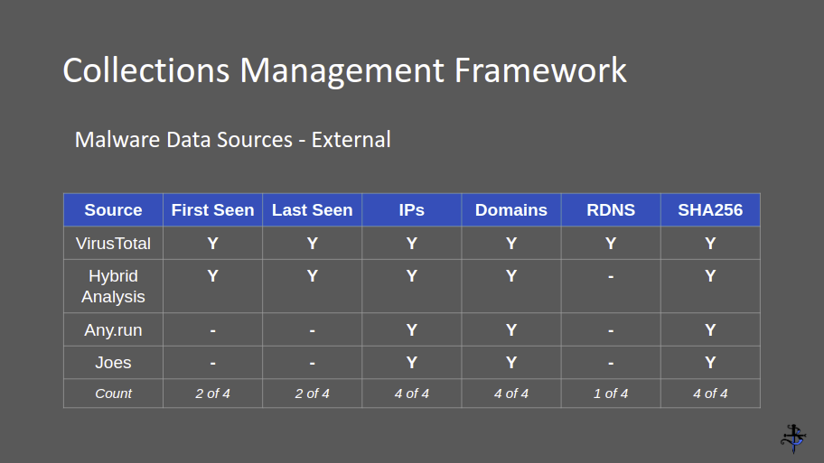
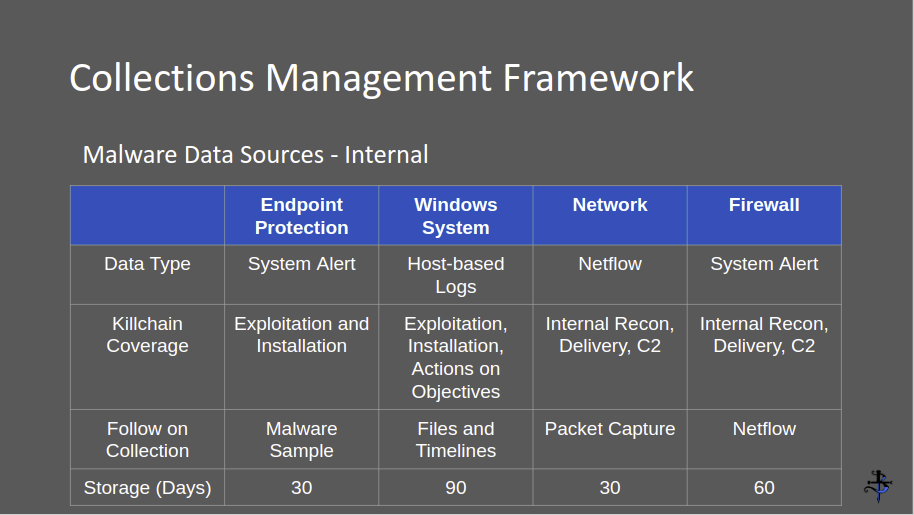

# Project Obsidian - CTI - Module 1 - CTI Fundamentals

## Overview

This module presents the fundamentals of Cyber Threat Intelligence (CTI). CTI is a nuanced topic with a variety of applications. Therefore, it is important that we have the same understanding of terminology, concepts, goals and objectives, etc.

This module covers: 

- Terminology & Definitions
- Understanding Intelligence
- Types of CTI
- CTI Lifecycle
- Indicators of Compromise
- Collection Management Framework (CMF)

### Objective

Simply put, the objective of module 1 is to understand the fundamentals of CTI.

## Terminology & Definitions

The terminology and definitions included were identified from various sources are publicly available.

Sources:

- TODO: add data sources
- https://attack.mitre.org/
- https://www.cisa.gov/tlp
- https://web.archive.org/web/20170914034202/https://blogs.rsa.com/understanding-indicators-of-compromise-ioc-part-i/
- Robert M. Lee
- Valentina Costa-Gazcon

### Cyber Threat Intelligence (CTI)

Analyzed information about the malicious intent, opportunity, and capability of an adversary that satisfies an intelligence requirement.

- The analysis is on the adversary/threat
- The focus is on satisfying stakeholder/customer requirements

Note: A number of different definitions for threat intelligence may exist. Differing definitions are fine, as long as it is understood that the focus is on the threat, the human. The focus is not on activities such as identifying vulnerabilities. Vulnerabilities represent an opportunity for an adversary to exploit but alone are not threats, just as malware alone is not a threat.

### Intelligence Requirement

A single question or concern raised by stakeholders that drives the threat intelligence life cycle. 

### Adversary or Threat

The human behind the keyboard who is involved in the execution of an attack or intrusion. The term 'threat' may be used interchangeably with 'adversary'. An important point is that vulnerabilities and tools are NOT defined as a threat.

### Intrusion

Any attempt, successful or not, by an adversary to gain unauthorized access to a system.

### Activity Group 

An activity group is a clustering of intrusions associated by similarities in infrastructure, capabilities, victim, and/or adversary. These four characteristics align with the diamond model for intrusion analysis so there is typically some sort of weighted associated with each characteristic.

### Threat Actor

The adversary responsible for an intrusion. The individual, team, organization, nation-state, etc that is responsible for the attack who is tracked across different intrusions.

### Campaign/Operation

Simply put, a campaign/operation is an adversaries mission.
 

### TLP

The Traffic Light Protocol is a standard for information sharing the uses White, Green, Amber, and Red as banners to identify how the information may be shared.

The following information was sourced from https://www.cisa.gov/tlp

#### TLP:WHITE

Sources may use TLP:WHITE when information carries minimal or no foreseeable risk of misuse, in accordance with applicable rules and procedures for public release.

Subject to standard copyright rules, TLP:WHITE information may be distributed without restriction.

#### TLP:GREEN

Sources may use TLP:GREEN when information is useful for the awareness of all participating organizations as well as with peers within the broader community or sector.

Recipients may share TLP:GREEN information with peers and partner organizations within their sector or community, but not via publicly accessible channels. Information in this category can be circulated widely within a particular community. TLP:GREEN information may not be released outside of the community.

#### TLP:AMBER

Sources may use TLP:AMBER when information requires support to be effectively acted upon, yet carries risks to privacy, reputation, or operations if shared outside of the organizations involved. 

Recipients may only share TLP:AMBER information with members of their own organization, and with clients or customers who need to know the information to protect themselves or prevent further harm. Sources are at liberty to specify additional intended limits of the sharing: these must be adhered to.

#### TLP:RED

Sources may use TLP:RED when information cannot be effectively acted upon by additional parties, and could lead to impacts on a party's privacy, reputation, or operations if misused.

Recipients may not share TLP:RED information with any parties outside of the specific exchange, meeting, or conversation in which it was originally disclosed. In the context of a meeting, for example, TLP:RED information is limited to those present at the meeting. In most circumstances, TLP:RED should be exchanged verbally or in person.

### Victim

The target of an adversaries campaign/operation. A victim could be an individual, a network, or a system compromised during the course of a campaign or operation.

### Target

The intended victim of an intrusion.

### Persona

The false name or identifier an adversary uses as a disguise. Persona’s can be operated by one or more adversaries operating in the same or different groups.
 

### TTP

Tactics, techniques, and procedures. A tactic is the high-level tradecraft an adversary intends to use to reach an objective, e.g. compromise a domain controller to get passwords of target accounts). A technique is the manner in which the adversary is going to accomplish that tactic, e.g. leveraging a specific exploit to gain access to a domain controller. A procedure is the granular approach to accomplishing the technique, e.g. the commands used to launch an exploit.

 
### Tradecraft

Tradecraft refers to the capabilities, methods, and resources used by an adversary. Tradecraft is more broad than TTPs and can be thought of as the modus operandi (M.O.) of the adversary; not only the way adversaries perform their actions but what they choose to leverage when performing them.

Tradecraft most commonly aligns to activity groups, as it may represent different clusters of intrusions that represent different aspects of TTPs.

### Indicator of Compromise (IOC)

An IOC is a forensic artifact or remnant of an intrusion that can be identified on a host or network.

### IOC Pivoting

The act of using one IOC (data point) to find more data or information, i.e. context, around an intrusion. Pivoting can be performed on host and network artifacts. IOC pivoting can generate intelligence. Outcomes include:

- Gaining insight into an adversaries infrastructure
- Revealing capabilities deployed by an adversary
- Identifying the family of malware used as part of an intrusion
- Attributing malware and/or infrastructure to an adversary
- Identifying IOCs realted to a campaign

Any new data, information, and intelligence that can be generated from IOC pivoting will:

- Enrich existing knowledge by adding context around an intrusion
- Enhance our ability to respond to an active threat
- Provide opportunities for new detections

The importance of performing this type of research can not be understated. IOC pivoting is a skill that should be practiced on a regular basis and will develop over time.

## CTI Overview

The goal of this section is to provide a general understanding of CTI. Links for learning more about the theory of intelligence will be provided at the end of this section.

### Data, Information, and Intelligence

It's worth showing the relationship between data, information, and intelligence through a few graphics that model the relationship ver ywell. The first is a knowledge pyramid. To make this fit our needs 'Intelligence' has been added.

**Data**

Raw data are the building blocks of information. Raw data includes:

* IP addresses
* Domain names
* URLs
* File hashes
* Registry keys
* etc.

Collecting raw data is a critical step in generating intelligence. As a CTI program matures, so should its data collection. This does not mean the volume of data sources should increase, which could introduce false-positives or result in other undesirable impacts.

An IP address alone is not intelligence, it's data. For example, this is an IP address.

**Information**

Example: This IP address is a command-and-control (C2) for this malware.

**Intelligence**

Example: We assess that the adversary we are tracking is not specifically targeting the organization and that this is an incidental intrusion.

### Additional CTI Resources

Sherman Kent and the Profession of Intelligence Analysis
The Sherman Kent Center for Intelligence Analysis Occasional Papers: Volume 1, Number 5, https://apps.dtic.mil/sti/pdfs/ADA526587.pdf
* Kent’s Analytic Doctrine

Psychology of Intelligence Analysis
Richards J. Heuer, Jr.
CENTER for the STUDY of INTELLIGENCE, Central Intelligence Agency, 1999,
https://www.ialeia.org/docs/Psychology_of_Intelligence_Analysis.pdf
* Tools for Thinking
* Cognitive Biases
* Improving Intelligence Analysis

Mental Models for Learning Design,
https://www.litmos.com/blog/articles/mental-models-learning-design

The Diamond Model of Intrusion Analysis by Sergio Caltagirone and Andrew Pendergast,
https://www.activeresponse.org/wp-content/uploads/2013/07/diamond.pdf

Lockhead Martin Cyber Kill Chain, 
https://www.lockheedmartin.com/en-us/capabilities/cyber/cyber-kill-chain.html

MITRE ATT&CK, 
https://attack.mitre.org/

## Types of CTI

Threat intelligence can be broken down into three distinct categories, each with its own objective and audience.

Source: https://www.crowdstrike.com/cybersecurity-101/threat-intelligence/

### Tactical Intelligence

**Objective:** Obtain technical details of threats in order to detect and prevent attacks

**Audience:** SOC Analysts, SIEM, Firewall, Endpoints, IDS/IPS

Tactical intelligence is technical data that identifies indicators of compromise (IOCs) in the immediate future. IOCs are pieces of data such as malicious IP addresses, URLs, file hashes, and domain names. IOCs can be machine-readable so that security platforms can ingest them through feeds or API integration.

Tactical threat intelligence provides information about the TTPs used by adversaries to achieve their goals and objectives, e.g., to gain initial access, move laterally, etc. Tactical intelligence is intended to help defenders understand how their organization is likely to be attacked so they can determine whether appropriate detection and mitigation mechanisms are in place or whether they need to be implemented.

Tactical intelligence is usually found through automated, open source data feeds. It has a very brief lifespan since IOCs such as domains can change within hours.

While there are many open IOC feeds, not all data may be relevant to your organization and some sources may have false positives.

### Operational Intelligence

**Objective:** Engage in campaign tracking and threat actor profiling to gain a better understanding of the adversaries behind the attacks

**Audience:** SOC Analysts, Threat Hunter, Vulnerability Mgmt, Incident Responders, Security Management

Operational intelligence pulls together the who, why, and how of an attack to give insight into how the adversary plans, executes, and sustains campaigns. The "who" is referred to as attribution, "why" is referred to as motivation or intent, and "how" is the TTPs used.

Operational intelligence can't be created from automated feeds; people must perform analysis and convert data into stakeholder-consumable information. It generally has a longer lifespan than tactical intelligence since adversaries don't change their modes of operation as quickly as domains or other IOCs.

This intelligence is best for security professionals concerned with day-to-day monitoring, incident response, and vulnerability management since it helps make them more effective.

### Strategic Intelligence

**Objective:** Threat intelligence should inform business decisions and the processes behind them

**Audience:** C-Suite, Executive Board, Security Management

Strategic intelligence pieces together how high level factors like foreign policies, global events, and other international movements can impact the security of an organization and understand the threats they are up against. 

This intelligence is aimed at decision makers, typically management, and helps them understand the risks from different security threats. 

Strategic intelligence is hardest to create since it requires manual data collection and analysis along with expertise in security and the state of world politics. It's usually produced as a report.

## CTI Lifecycle

Intelligence is both a process and a product. The intelligence process can be divided into a six-phase cycle: planning and direction, preparation and collection, processing, analysis and production, dissemenation, and feedback and evaluation. Each phase includes its own characteristics, challenges, and level of maturity. The CTI lifecycle is an iterative and adaptable methodology containing six phases that ultimately converts raw data into a CTI product.

* Planning & Direction
* Preparation & Collection
* Processing
* Analysis & Production
* Dissemenation
* Feedback & Evaluation

The CTI lifecycle process is a cycle because new questions and gaps in knowledge are identified during the course of generating intelligence, leading to new requirements being defined. Implementing an effective threat intelligence program is an iterative process, becoming more refined over time. This is demonstrated by the CTI Maturity Matrix below created by Clay Wells c/o Security Risk Advisors.

**CTI Lifecycle Resources**

Joint Intelligence, Joint Publication 2-0, 22 June 2007
https://www.jcs.mil/Doctrine/Joint-Doctrine-Pubs/2-0-Intelligence-Series/

### Planning & Direction

The planning and direction phase is when CTI goals and objectives are set. At a minimum, planning and direction should include the following activities:

* Identify critical assets and business processes
* Determine why and how the organization might be a targeted
* Establish stakeholder requirements, e.g. what are their security concerns
* Identify potential threats, i.e. adversaries, to the organization
* Select and prioritize mitigations based on potential threats to the organization

The program will develop and mature over time. This phase will occur many times throughout the lifespan of a CTI program, providing opportunities to adjust and readjust in order to meet the demands of the organizations ever-changing threat landcape.

### Preparation & Collection

Preparation and collection is the process of gathering information to satisfy an organizations intelligence requirements. In order to gather information an organizations must define and develop its collection methods. Collection occurs through a variety of means, including:

* Pulling metadata and logs from internal networks and security devices
* Subscribing to threat data feeds from industry organizations and cybersecurity vendors
* Holding conversations and targeted interviews with knowledgeable sources
* Scanning open source news and blogs
* Scraping and harvesting information from websites and forums
* Infiltrating closed sources such as dark web forums

The data collected will typically be a combination of CTI products, such as adversary reports, and raw data, such as malware hashes or IP addresses of command and control (C2) servers.

### Processing

Processing is the transformation of collected data into a format usable by the organization. Almost all raw data collected needs to be processed in some manner, whether by humans or machines or both. Different collection methods often require different processing methods. Data may need to be correlated, ranked, de-duplicated, or verified.

One example is extracting IP addresses from a security vendor’s report and adding them to a CSV file for importing into a security information and event management (SIEM) platform. In a more technical area, processing might involve extracting indicators of compromise (IOCs) from an email, enriching them with other data, and sending to endpoint protection tools for blocking.

Data and information should be aggregated, tagged, and stored in a database or CTI platform for analysis and future assessments. With data, information, and intelligence organized and stored in a CTI platform, exports can be produced for reporting and dissemenation.

### Analysis & Production

Analysis is a human process that turns information into intelligence that can operationalized by all stakeholders. The CTI product produced will vary from stakeholder to stakeholder and should be presented in a format appropriate for the given audience. For example, if the goal is to communicate with non-technical leaders, your report must:

* Be concise
* Avoid confusing and overly technical terms and jargon
* Articulate the issues in business terms (such as direct and indirect costs and impact on reputation)
* Include a recommended course of action

Several techniques can and should be used during the analysis process, including those used to identify and prevent biases. This is a topic the CTI team needs to discuss on an ongoing basis. A good exercise to make use of is to regularly review and evaluate your work and the work of others. If you notice the following, the source may be biased[a]:

* Heavily opinionated or one-sided
* Relies on unsupported or unsubstantiated claims
* Presents highly selected facts that lean to a certain outcome
* Pretends to present facts, but offers only opinion
* Uses extreme or inappropriate language
* Tries to persuade you to think a certain way with no regard for factual evidence
* The author is unidentifiable, lacks expertise, or writes on unrelated topics
* Is entertainment-based or a form of parody or satire
* Tries to sell you something in disguise

Intelligence may need to be delivered in a variety of formats for different audiences. Not all intelligence needs to be presented in a report. Successful threat intelligence teams provide continual technical reporting to security teams along with additional context, e.g. around IOCs, malware, threat actors, vulnerabilities, and trends.

[a] https://libguides.uwgb.edu/bias

### Dissemenation

During this phase intelligence is delivered to and used by stakeholders. Dissemination is facilitated by a variety of means. The means must be determined by the needs of each stakeholder and the implications and criticality of the intelligence.

For each stakeholder, you need to ask:

* What threat intelligence do they need, and how can external information support their activities?
* How should the intelligence be presented to make it understandable and actionable for each stakeholder?
* How often should we provide updates and other information?
* Through what media should the intelligence be disseminated?
* How should we follow-up if they have questions?

### Feedback and Evaluation

Feedback from stakeholders is both challenging and critical to the success of any CTI program. Processes for receiving feedback from stakeholders must be established during the planning phase. Feedback will enable the CTI team to evaluate the effectiveness of the intelligence being generated before they repeat the process.

## Indicators of Compromise

David J Bianco's pyramid of pain.

## Collection Management Framework (CMF)

A CMF is the documentation and plan for how to collect data, where to collect data from, and what type of data to collect. The CMF will provide insight into what questions can and can not be answered by the data being collected.

- Creating a collections management framework (CMF) should be one of the first things to do when building a CTI program
- The CMF is a living document that should be reviewed and updated on a regular basis
- A CMF should be created for both external and internal data sources

- Documenting external data sources for malware data collection makes a quick reference to identify which data points each source provides
- Spot redundancies and decide to keep or drop the source
- Identify must-have sources based on your data requirements
- Enables strategic and operational-level questions...
	- Do our current data sources provide with the data we need to meet our CTI requirements?
	- Which data elements do we need more visibility into and which sources do we need to include to collect those data elements?
-

Resources:

https://www.dragos.com/wp-content/uploads/CMF_For_ICS.pdf
