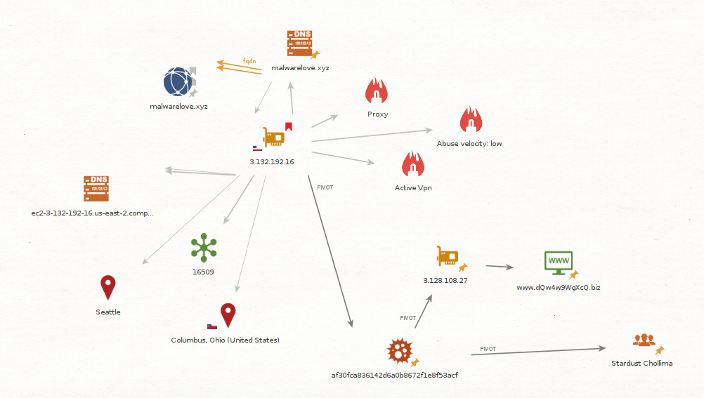

# Project Obsidian - CTI - Module 3 - Generating Threat Intelligence from an Incident

## Overview

This module presents an overview of how threat intelligence can be generated from an incident and shared with various stakeholders. We'll run through an incident and demonstrate how the CTI team plays a critical role by performing research and providing insights based on stakeholder requirements.

This module covers: 

- Direction & Planning: Overview of CTI stakeholders and intelligence requirements
- Collection: CTI analysts role during an incident
- Analysis & Production: Elements to include in a report
- Dissemination: Sharing the report with stakeholders
- Feedback & Evaluation: Methods for receiving feedback

### Objective

Demonstrate the important role CTI plays both during and after an incident.

## Direction & Planning: Overview of CTI stakeholders and intelligence requirements

As mentioned in module-1, the planning and direction phase is when CTI requirements are created. For our scenario our stakeholders include:

- CISO, CTO, CIO, Executive Board
- Security Operations Center (SOC)
    - Defenders
    - Forensics team
    - IR team
    - Malware analysis team
    - Threat hunting team
- SOC management
- IT team

Along with intelligence requirements, goals and objectives should also be created. Goals and objectives provide additional outputs that serve to enable other teams to produce intelligence-driven content. This type of research should be performed on an ongoing basis and can help to satisfy intelligence requirements.

While performing research during an incident isn't exactly a stakeholder requirement, the CTI team should dig into IOCs with the goal of finding new information that can be used to inform the different teams involved in working an incident. Various tools and analycial methods can be used to perform this type of research. One of the tools we'll be using is the community version of Maltego.

## Collection: CTI analysts role during an incident

During the course of an incident suspicious processes, commands, domains, URLs, IP addresses, and other artifacts, i.e. data/information, will be discovered. A process that enables the CTI team to receive IOCs and their context from other teams (IR, forensics, etc) in a timely fashion needs to be defined, documented, and socialized. 

### IOCs

The following IOCs were identified by the forensics and malware analysis teams.

- malwarelove.xyz
- 3.132.192.16

### TTPs

The following commands were identified by the forensics team.

**MITRE Tactics and Techniques**

- Tactic TA0001: Initial Access
- Technique T1566: Phishing, https://attack.mitre.org/techniques/T1566/

**Commands & Tools**

- C:\Windows\system32\net.exe 
- C:\Windows\Temp\cleanup.exe 
- C:\Windows\Temp\p.exe
- C:\Windows\Temp\met64.exe

## Processing: Intrusion Data & Information

TODO: add summary/graphic

## Analysis & Production: Elements to include in a report

The CTI team will produce a variety of outputs and deliverables for the various stakeholders. The CTI team will meet with each stakeholder to define and document the deliverables and formats required. For Magnum Tempus, the following will be provided.

### Maltego Graph

Maltego is a tool that is used to pivot on data and explore connections between attacker IPs, domains, URLs, TLS certificates, malware, and a wide variety of other data.

Loading IOCs into Maltego and running transforms on them can produce interesting and useful results. Below is an example of how running transforms on an IP address can lead to useful information and intelligence that can be shared across teams.

### MITRE ATT&CK Navigator Layer

The ATT&CK Navigator is a web-based tool for annotating and exploring ATT&CK matrices. It can be used to visualize defensive coverage, red/blue team planning, the frequency of detected techniques, and more.

Including a MITRE ATT&CK navigator heatmap of the TTPs associated with an incident is a great way to visualize the TTPs used by the adversary.

The MITRE ATT&CK navigator heatmap below is an example of what could be made using Obsidian kill chain 1. Some details aren't included. Completing the heatmap is left as an exercise for the reader.

### Intrusion Summary

Intrusion's can be summarized using the diamond model for intrusion analysis. This is a critical step when tracking intrusions. Intrusion analysis, both failed and successful, are the best source of intelligence as it provides insight into attacks the organization is experiencing.

Intrusions can be clustered together based upon defined criteria. For example, similarities in infrastructure and capabilites combined and weighted together with more signifigance than the victim. The goal is to track both failed and successful intrusions. Summary information is generally small and lightweight making data storage less of a concern. It's possible that efficiencies could be made over time so keep an eye out for these opportunities.

## Dissemination

For this module all of the teams were involved in the incident and are aware of the outcomes. Aside from the IR report being delivered to stakeholders, dissemination is not required in this scenario.

## Feedback & Evaluation: Methods for receiving feedback

During the planning and direction phase, a process for providing feedback to the CTI team needs to be defined, 
documented, and socialized. Ongoing feedback is critical to the success of any CTI program.

